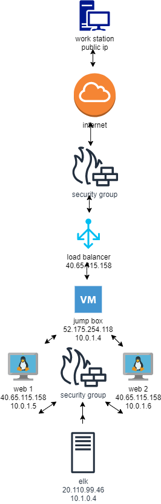

# Hoormann-Project-1
First class project 
## Automated ELK Stack Deployment

The files in this repository were used to configure the network depicted below.

These files have been tested and used to generate a live ELK deployment on Azure. They can be used to either recreate the entire deployment pictured above. Alternatively, select portions of the playbook file may be used to install only certain pieces of it, such as Filebeat.

 
* [playbook.yml](./Ansible/playbook.yml) - Used to install DVWA Servers.
* [elk.yml](./Ansible/elk.yml) - Used to install Elk Server.
* [filebeat-playbook.yml](./Ansible/filebeat-playbook.yml) - Used to install and configure Filebeat on ELK Server and DVWA Server.
* [mtericbeat-playbook.yml](./Ansible/metric-playbook.yml)

This document contains the following details:
- Description of the Topologu
- Access Policies
- ELK Configuration
  - Beats in Use
  - Machines Being Monitored
- How to Use the Ansible Build

### Description of the Topology

The main purpose of this network is to expose a load-balanced and monitored instance of DVWA, the D*mn Vulnerable Web Application.

Load balancing ensures that the application will be highly available, in addition to restricting access to the network.
Load balancers keep the system from getting bogged down and keeps them safer from attacks. The advantage of a jump box is that it provides more security. 

Integrating an ELK server allows users to easily monitor the vulnerable VMs for changes to the logs and system traffic.
- Filebeat monitors log files and locations and collects information and forwards it for indexing. 
- Metricbeat helps you monitor servers by collecting metrics from system and services running on them. 

The configuration details of each machine may be found below.

### Access Policies

The machines on the internal network are not exposed to the public Internet.

Only the Elk machine can accept connections from the Internet. Access to this machine is only allowed from the following IP addresses:
- Jump Box 10.0.1.4  SSH Port 22

Machines within the network can only be accessed by the Jumpbox.
- Workstation Port 5601

A summary of the access policies in place can be found in the table below.
| Name                 	| Function       	| IP Address             	| os    	|
|----------------------	|----------------	|------------------------	|-------	|
| Jump-Box-Provisioner 	| Gateway        	| 52.175254.118/10.0.1.4 	| Linux 	|
| Web 1                	| Web Server     	| 40.65.115.158/10.0.1.5 	| LInux 	|
| Web 2                	| Web Server     	| 40.65.115.158/10.0.1.5 	| Linux 	|
| Elk                  	| Elk Server     	| 20.110.99.46/10.1.0.4  	| Linux 	|
| Load Balancer        	| Load Balancer  	| 40.65.115.158          	| Linux 	|
| Workstation          	| Access Control 	| Public IP              	| Linux 	|

### Elk Configuration

Ansible was used to automate configuration of the ELK machine. No configuration was performed manually, which is advantageous because...
- No special coding skills needed it creates efficiencies and ensures security. 

The playbook implements the following tasks:
- Docker install
- Image downloaded
- Configured container
- Created playbook with Docker, Filebeat and Metricbeat
- Launched the container

The following screenshot displays the result of running `docker ps` after successfully configuring the ELK instance.

### Target Machines & Beats
This ELK server is configured to monitor the following machines:
- Web 1 (10.0.1.5)  Web 2 (10.0.1.6) 
- Filebeat and Metricbeat

These Beats allow us to collect the following information from each machine:
- Filebeat for collecting logs on remote machines can forward them to either Elasticsearh or Logstash. 
- Metricbeat collects metrics from the operating stystem and takes that information to places as Elasticsearch or Logstash.
### Using the Playbook
In order to use the playbook, you will need to have an Ansible control node already configured. Assuming you have such a control node provisioned:

SSH into the control node and follow the steps below:
- Copy the Elk install file to the Elk server.
- Update the yml file to include installer
- Run the playbook, and navigate to Jump box to check that the installation worked as expected.

_TODO: Answer the following questions to fill in the blanks:_
- _Which file is the playbook? elk.yml Where do you copy it? /etc/ansible
- _Which file do you update to make Ansible run the playbook on a specific machine? /etc/ansible/hosts How do I specify which machine to install the ELK server on versus which to install Filebeat on? etc/ansible/hosts
- _Which URL do you navigate to in order to check that the ELK server is running?

_As a **Bonus**, provide the specific commands the user will need to run to download the playbook, update the files, etc._
